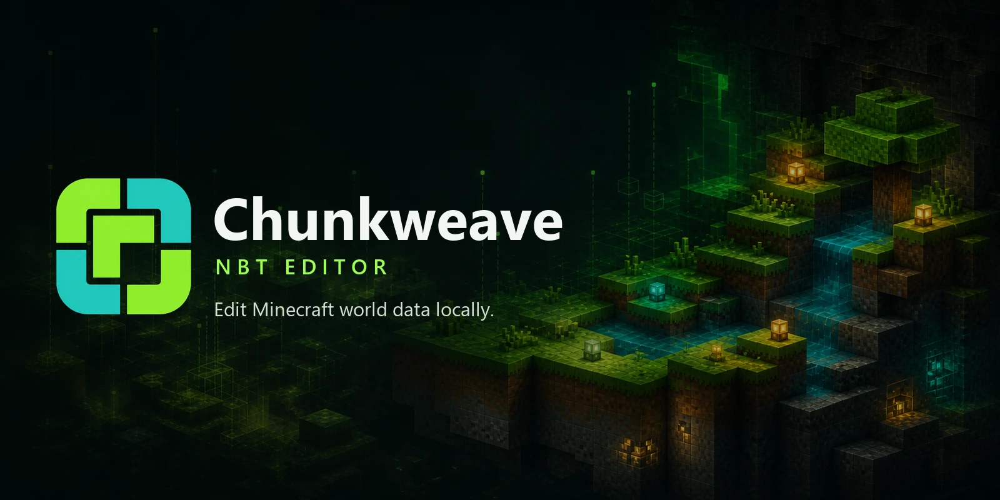

# Chunkweave NBT Editor

Chunkweave is a browser-based NBT editor for Minecraft Java Edition world files. Open a supported file, inspect its typed NBT tree, stage changes, and download a separate copy without uploading the file to a server.

## Try it online

**[Open the NBT editor](https://nbteditor.org/)**

No installer, account, or cloud storage is required for the current workflow.

## What it supports

| File type | Typical use |
| --- | --- |
| `.nbt` | Structure files and other NBT payloads |
| `.dat` | World metadata and player data |
| `.mca` | Anvil region files and populated chunks |
| `.mcr` | Legacy Minecraft region files |
| `.schematic` | Legacy schematic workflows |

Chunkweave is designed for **Minecraft Java Edition**. Bedrock Edition files are not the target of this editor.

## Why use it

- **Local processing:** the selected file is parsed and rebuilt in your browser.
- **Typed editing:** compounds, lists, strings, numbers, arrays, and other NBT types remain visible in context.
- **Separate export:** the original file stays untouched while you download an edited copy.
- **Region awareness:** supported region files can be explored through their chunk layout.

## Guides

- [How to edit `level.dat` in Minecraft Java Edition](https://nbteditor.org/blog/how-to-edit-level-dat)
- [How to edit Minecraft `playerdata`](https://nbteditor.org/blog/how-to-edit-playerdata)
- [Why Minecraft NBT changes do not take effect](https://nbteditor.org/blog/minecraft-nbt-changes-not-working)
- [Recover a corrupted `level.dat` safely](https://nbteditor.org/blog/recover-corrupted-level-dat)
- [Minecraft Java world files explained](https://nbteditor.org/blog/minecraft-java-world-files)
- [Safe Minecraft NBT editing checklist](https://nbteditor.org/blog/safe-minecraft-nbt-editing)
- [NBTExplorer alternative](https://nbteditor.org/nbtexplorer-alternative)

## A safe editing workflow

1. Back up the complete world folder.
2. Stop Minecraft or the server before touching files.
3. Open a copy in Chunkweave.
4. Edit only the intended tag and review the full NBT path.
5. Download a separate copy.
6. Test the edited copy before replacing a live-world file.

Read the full [safe editing checklist](docs/safe-editing.md) before changing a world or server save.

## About this repository

This is the public documentation and project showcase for Chunkweave. The application source code is maintained separately. The repository exists to document the tool, provide safe editing references, and make the project easy to discover and discuss.

## Disclaimer

Chunkweave is an independent community project and is not affiliated with, endorsed by, or sponsored by Mojang or Microsoft. Minecraft is a trademark of Microsoft Corporation.

## Feedback

For product feedback or documentation corrections, open an issue in this repository. For private security reports, see [SECURITY.md](SECURITY.md).
